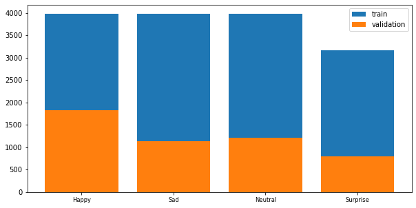

# Face-Recognition

The goal of this project is to create a computer vision model that can accurately detect facial emotions.The model should be able to perform multi-class classification of facial expressions,to classify the expressions according to the associated emotion.

The key questions which arise here, can be formulated as following:

  1) What is the most suitable algorithm for such problem and why it can be useful in comparison to others?

  2) What type of data should be used?

  3) How the performance of the model can be measured?

From Data Science's perspective, the problem can be formalized as the following:
create a supervised machine-learning algorithm, which would be able to classify a given data containing a particular facial expression into one of the pre-determined categories of such expressions.

# Data exploration
The data for this project consists of the images, on each of them a human face depicted, categorized as one of the given four labels:

**Happy**: Images of people who have happy facial expressions.

**Sad**: Images of people with sad or upset facial expressions.

**Surprise**: Images of people who have shocked or surprised facial expressions.

**Neutral**: Images of people showing no prominent emotion in their facial expression at all.

In the traditional machine learning framework, we'll split the data into three subsets, named as train, validation and test. The model will be trained on the first subset (which is typically the largest), the second will be used to prevent over-fitting of the model, and the test dataset is devoted for checking the performance of the model on new (unseen) data. 

The distribution of the categories on the training dataset is shown below. It can be observed that except the 'Surprise' category, all other types are almost of the same size, between 3 and 4 thousands of images. Overall, the distribution of classes can be considered as approximately balanced, i.e. there is no over-represented or under-represented class.

# Modeling approach

For the described classification problem task the Convolutional Neural Network seems to be a good choice for several reasons:

  1) Feature space of the data is quite high-dimensional, that's why more complex models such as networks are favorable

  2) A single observation, an image, represents the unstructured type of information. The best approach existing so far for dealing with images are the CNN, that's why they were chosen here.

There are two major approaches would be done for this particular project:

  1) **Transfer learning** approach: take one of the well-known architecture of computer vision network, such as VGG, ResNet or EfficientNet, whose weights are already trained, add some extra layers and train the obtained network with fixed weights of the original base network

  2) Create manually CNN, by experimenting with number and structure of convolutional blocks.

Since we have a multi-classification task, suitable metric for the model is *accuracy*, which is the ratio of corrected predictions over all of the predictions.
